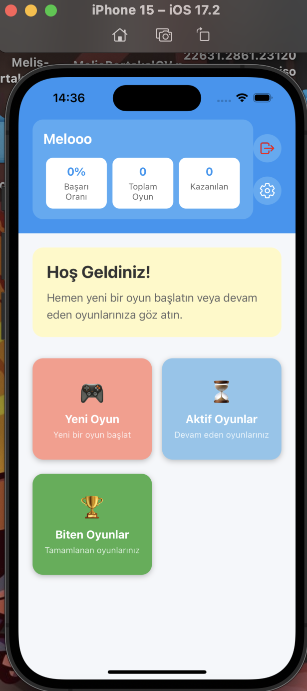

KOCAELİ ÜNİVERSİTESİ BİLGİSAYAR
MÜHENDİSLİĞİ BÖLÜMÜ
YAZILIM LAB. II- II. Proje
PROJE TESLİM TARİHİ: 02.05.2025
Kelime Mayınları
Mobil Oyun Programlama

Bu projede mobil programlama kullanılarak kelime tabanlı bir oyun geliştirilmesi
hedeflenmektedir. Oyun iki kişilik olacak ve dinamik özellikler içerecektir. Oyunun alt
yapısının sunucu istemci mimarisi kullanılarak tasarlanması ve platform üzerinden birden
fazla oyunun aynı anda oynanabilmesi beklenmektedir.

Amaç:
1. Mobil programlama konusunda bilgi ve beceri kazanılması
2. Mobil programlama aracılığıyla oyun geliştirme ve uygulama oluşturma
becerisinin geliştirilmesi.
3. Dinamik özelliklere sahip bir program geliştirebilme
4. İstemci -Sunucu kurulumunun öğrenilmesi

Programlama Dili: Java, Kotlin, Flutter, React Native, Swift vb.

Mobil Programlama

1. Mobil programlama kodları Android veya IOS için geliştirilmelidir.

2. Kodlama için herhangi bir programlama dili kullanılabilir.

3. Geliştirilecek uygulama kelime tabanlı bir oyundur. Bundan dolayı oyunda kelime
listesinin kullanılması gereklidir.

4. Oyun üyelikler üzerine ilerleyeceği için oyuncuların oyuna kayıt olması, kayıtlı
oyuncuların ise kullanıcı adı ve şifresi ile oyuna giriş yapabilmesi gerekmektedir.
Uygulama Yapısı
Kullanıcı Girişi ve Kayıt İşlemleri
Kullanıcı uygulamayı açtığında ekranda iki seçenek sunulacaktır: Kayıt Ol ve Giriş Yap. Bu
seçenekler aşağıda ayrıntılı olarak açıklanmıştır.
Kayıt Ol:Bu seçenekte kullanıcılar sisteme kayıt olacaktır. Kayıt işlemi sırasında aşağıdaki
bilgiler talep edilecektir:

● Kullanıcı adı: Her kullanıcının benzersiz (unique) bir kullanıcı adına sahip olması
gerekmektedir.

● E-posta: Girilen e-posta adresinin geçerli olup olmadığı kontrol edilecektir. Örneğin,
yazlab2@kocaeli.edu.tr

● Şifre: Şifre en az 8 karakter uzunluğunda olmalı, büyük/küçük harf ve rakam
içermelidir.

Giriş Yap:Bu seçenekte kullanıcılar sisteme giriş yapacaktır. Giriş işlemi, kullanıcı adı ve
şifre kullanılarak gerçekleştirilecektir.

Oyun Giriş Ekranı ve Süre Seçenekleri
Sisteme giriş yapıldıktan sonra, ekranın üst kısmında kullanıcı bilgisi ve başarı yüzdesini
gösteren bir alan yer alacaktır. Başarı yüzdesi, kazanılan oyun sayısının toplam oynanan
oyun sayısına bölünmesiyle hesaplanacaktır. Başlangıçta başarı yüzdesi 0 olarak
görünecektir.
Ekranın ortasında Yeni Oyun, Aktif Oyunlar ve Biten Oyunlar olmak üzere üç farklı
tıklama alanı bulunacaktır.

● Yeni Oyun kısmına tıklandığında, kullanıcıya oyun süresine bağlı olarak dört farklı
seçenek sunulacaktır:

○ Hızlı Oyun:
■ 2 dakika: Kullanıcılar, 2 dakika içinde kelimeyi yazmalıdır. Yazmazsa
oyunu kaybeder.
■ 5 dakika: Kullanıcılar, 5 dakika içinde kelimeyi yazmalıdır. Yazmazsa
oyunu kaybeder.

○ Genişletilmiş Oyun:
■ 12 saat: Kullanıcılar, 12 saat içinde kelimeyi yazmalıdır. Yazmazsa
oyunu kaybeder.
■ 24 saat: Kullanıcılar, 24 saat içinde kelimeyi yazmalıdır. Yazmazsa
oyunu kaybeder.
Bu sürelerden biri seçilecektir. Seçim yapıldıktan sonra aynı süreyi seçen iki kullanıcı
rastgele bir şekilde eşleştirilerek oyun başlatılacaktır.

● Aktif Oyunlar kısmında, kullanıcının daha önce başlattığı ve halen devam eden
oyunlar listelenecektir. Bu listeninin her bir oyununda rakibin adı, kullanıcının
puanı, rakibin puanı ve oyun sırasının kimde olduğu gibi bilgiler yer alacaktır.
Kullanıcı, oyun üzerine tıklayarak aktif oyuna geçiş yapabilir ve kaldığı yerden devam
edebilecektir.

● Biten Oyunlar kısmında, tamamlanan oyunların bilgileri gösterilecektir. Kullanıcının
puanı, rakibinin puanı ve oyunun sonucunu (kazanma veya kaybetme) belirten bir
işaret veya bilgi yer alacaktır. Ayrıca, rakibin kullanıcı adı da bu alanda görünecektir.

4. Oyun Alanı ve Harf Dağılımı
● Oyun Açıldığında 15X15 lik bir matris gelecektir. Bu matrisinin gösterimi aşağıdaki
şekilde verilmiştir. Bu matris üzerinde Kelime ve Harfe göre puan değişikliği yapılan
özel alanlar bulunmaktadır. Bu alanlar aşağıdaki görselde verilen yerlerde olması
gereklidir. Bu harf ve kelimelerin anlamları aşağıda açıklanmıştır.
Oyuncunun ürettiği bir kelimeden alacağı puan, kelimede kullanılan harflerin üzerinde
bulunan sayılara ve kelimenin tahtada konulduğu yere göre hesaplanır. Joker ile oluşturulan
harfler ise 0 puana sahip şekilde hesaplamaya katılır. Her harfin puanı harfin türkçe
kelimelerdeki kullanım sıklığına göre belirlenmiştir.

Oyun başlangıcında matris ile birlikte her kullanıcıya 7 farklı harf verilecektir. Bu harfler
Matrisin altında bir bölüm oluşturulacak ve kullanıcıya gösterilecektir. Bu harfler kullanıldıkça
kullanılan adet kadar harf havuzundan harf verilecektir. En son harf bittiğinde kalan harfler
kullanılacaktır.
Bu harflerin toplam sayısı 100 adettir. Bu 100 adetten ilk başta 7 tanesi kullanıcıya ve 7
tanesi rakibine verilerek oyun başlatılacaktır. Bu harflerin her birinin kendine ait puanları
bulunmaktadır. Harflerin puanları ve sayı adetleri aşağıdaki tabloda verilmiştir.

HARF SAYISI PUANI HARF SAYISI PUANI
A 12 1 M 4 2
B 2 3 N 5 1
C 2 4 O 3 2
Ç 2 4 Ö 1 7
D 2 3 P 1 5
E 8 1 R 6 1
F 1 7 S 3 2
G 1 5 Ş 2 4
Ğ 1 8 T 5 1
H 1 5 U 3 2
I 4 2 Ü 2 3
İ 7 1 V 1 7
J 1 10 Y 2 3
K 7 1 Z 2 4
L 7 1 JOKER 2 0

Ayrıca ana ekranda en üste kalan harf sayısı ortada olacak şekilde bir alan olacaktır. Bu
kalan harf sayısının solunda kendi kullanıcı adınız ve puanınız, sağ tarafında ise rakibiniz
kullanıcı adı ve puanı yer alacaktır. Örnek gösterim aşağıdaki şekilde görülmektedir.

Oyunun başlatılması için rastgele bir şekilde bir oyuncuya başlangıç sırası verilecektir. Bu
kullanıcı matrisin ortasındaki kısma bir harf gelecek şekilde elindeki harfleri kullanarak
anlamlı bir kelime yazarak onay butonuna basacaktır. Onay butonuna bastığında sıra
rakibine geçecek ve rakibin seçilen süre içerisinde kelimesinin yazması bekleyecektir. Bu
işlem karşılıklı olarak kelime yazıp onay şekilde devam edecektir.
Kelime yazılması sırasında kelimenin sağ altında kelimeden elde edilecek toplam puan
gösterilecektir.Ayrıca Oyuncunun yazdığı kelime, geçerli bir kelime olup olmadığına kontrol
sağlanacaktır. Bu kontrol için bir kelime listesi oluşturulması gerekmektedir.

Geçerli kelimeler yeşil renkte gösterilecektir. Geçersiz kelimeler kırmızı
renkte gösterilecektir

Kelime yazma için uyulması gereken kural ise aşağıdaki gibidir.
● Sıra kendinde olan kullanıcı elinde olan üreteceği yeni kelime tahtada bulunan
harflerden en az birine temas edecek şekilde konumlandırılmalıdır.
● Üretilen her yeni kelime birbirini takip eden harflerden oluşacak şekilde dikey veya
yatay veya çapraz olarak konumlandırılmalıdır.
● Komşuluk harfler kullanılarak bir turda birden fazla kelimenin türetilmesi sağlanabilir
ancak türetilen her kelime anlamlı olmalıdır.
● Komşuluk ile yapılabilecek örnek kombinasyonlar.

Sıra kendinde olan kullanıcı kelime yazmayarak pas seçeneği ile sırasını pas geçebilecektir.
Benzer şekilde teslim olma seçeneği ile oyunu bitirebilecektir.
Sıra kendinde olan kullanıcı kelime yazmak yerine oyun tahtasında yer alan harflerden
birinin konumunu kendisine komşu alanlardan birine taşıyabilecektir. Bu taşıma işleminde
dikkat edilmesi gereken kural ise sadece 1 birim kaydırabilir ve kaydıracağı yerde daha önce
yazılmış bir harf olmamasına dikkat edilecektir. Bu işlem yapıldıktan sonra onay butonuna
basarak sıranın karşı rakibine geçecektir.
Oyun başlangıc aşamasında matris üzerinde cezalandırma amaçlı mayın adı verilen
bölümler olacaktır. Bu kısımlar oyun esnasında gözükmeyecektir. Arka tarafta matris
konumunda gizli şekilde kalacaktır. Bu ceza mayınlarının üzerine harf geldiğinde aktif olacak
ve özelliğine göre ceza uygulanacaktır. Örnek mayınlı gösterim ve mayın türleri ve
açıklamaları aşağıda yer almaktadır.

● Puan Bölünmesi: Bu mayının özelliği kullanıcının o kelimeden elde ettiği puanın
%30 kadar puanı almasını sağlar.Bu mayında 5 adet bulunmaktadır ve rastgele bir
şekilde matriste dağılmıştır. Örnek “Küpe” kelimesini yazdı ve mayına denk geldi.
K=1 +Ü=3 +P=5 +E=1 toplam 10 alması gerekirken 10 %30 olan 3 puan
kazanacaktır.

● Puan Transferi: Bu mayının özelliği kullanıcının o kelimeden elde ettiği puanın
tamamının rakip takıma verilmesidir. Yani kelimeden puan almamaktadır. Aldığı puan
rakip takıma puanına eklenmektedir. Bu mayından 4 adet bulunmaktadır.

● Harf Kaybı: Bu mayının özelliği kullanıcı kelime yazdıktan sonra elinde kalan
harflerinin havuza aktarılacaktır. Ve havuzdan kullanıcıya rastgele tekrardan 7 harf
verilecektir. Yani kısa özet olarak kullanıcı 3 harfli bir kelime yazdı ve elinde 4 harf
havuza verilecek ve bir sonraki turda kullanabilmesi için kullanıcıya yeniden rastgele
7 harf verilecektir. Oyun sonunda harf kalmadığı durumlarda harf havuza verilip
tekrardan aynı harfler verilebilir. Bu mayından 3 adet olacaktır.

● Ekstra Hamle Engeli: Bu mayının özelliği kullanıcı kelime yazdığı bölgede Harf ve
kelime katları olan bölgelere yazıldı ise bu özelliklerin iptal edilerek sadece harflerden
elde edilen puan kullanılacaktır. Eğer kelime içinde bu özellikler yoksa ve mayına
denk gelinirse herhangi bir işlem yapılmadan harflerden elde edilen puan
kullanılacaktır. Bu mayından 2 adet olacaktır.

● Kelime İptali:Bu mayının özelliği kullanıcının o kelimeden elde ettiği puanın iptal
edilerek herhangi bir puan almamasıdır. Kullanıcı puan almadan sırası rakibe
geçmektedir. Bu mayında 2 adet bulunmaktadır.
Benzer şekilde matris üzerinde Ödüllendirme amaçlı ödül adı verilen bölümler olacaktır. Bu
kısımlar oyun esnasında gözükmeyecektir. Arka tarafta matris konumunda gizli şekilde
kalacaktır. Bu ödüller üzerine harf geldiğinde aktif olacak ve daha sonra kullanılmak üzere
ödül alanına eklenecektir. Kullanılmak istendiğinde seçilip kullanılacaktır. Matris üzerindeki
ödüllerin özellikleri aşağıda gözükmektedir.

● Bölge Yasağı: Bu ödülü alan oyuncunun ekranına bu jokeri kullanabileceği bir simge
gelir. Bu ödülü kullandığı ödülün yazısına göre matrisin sağında veya solunda kalan
bölgeye karşı tarafta ki oyuncu harf koyamaz.”Rakip sadece matrisin sağ tarafına
harf koyabilir”. Yani orta çizgiyi sayılmazsa sadece sağ tarafta kalan 7*15 bölgesine
harf koyabilir. Bu ödülden 2 tane bulunmaktadır.

● Harf Yasağı: Bu ödülü alan oyuncunun ekranına bu jokeri kullanabileceği basılabilen
bir simge gelir. Kullanıcı buna bastığında karşı oyuncunun elinde olan 7 harften 2
tanesi donar. Karşı oyuncu sıra kendine geldiğinde bu harfleri 1 turluğuna
kullanamaz. Bu ödülden 3 tane bulunmaktadır.

● Ekstra Hamle Jokeri:Bu ödülü alan oyuncunun ekranına bu jokeri kullanabileceği
basılabilen bir simge gelir. Kullanıcı buna bastığında ikinci bir kelime hakkı kazanır.
Bu karta basıp kelimesini yazdığında sıra tekrardan kendisine gelir ve ikinci kelimeyi
yazmaya hak kazanır. Bu ödülden 2 tane bulunmaktadır.

Mayınların oyundaki dağılımı:
Mayın Türü Adet
Puan Bölünmesi 5
Puan Transferi 4
Harf Kaybı 3
Ekstra Hamle Engeli 2
Kelime İptali 2
Bölge Yasağı 2
Harf Yasağı 3
Ekstra Hamle Jokeri 2
Puanlama Sistemi

● Kullanılan her harfin puanları toplanarak kelimenin toplam puanı hesaplanarak önceki
elde edilen puanları eklenecektir.

● Kelimenin uzunluğu ve stratejik yerleşimi bonus kazandırabilir.

● Özel kareler (çift/triple puan bölgeleri) ekstra çarpanlarla daha fazla puan kazandırır.

● Mayına basma durumunda ilgili ceza uygulanır ve puan güncellenir.

8. Oyun Sonu ve Skor Hesaplama

● Kullanıcıların birinin elinde harf kalmayınca oyun biter. Elinde harf kalan oyuncunun
harflerin puanlarının toplamı taşlarını önce bitiren oyuncuya eklenirken aynı zamanda
elinde harf kalan oyuncudan ceza puanı olarak düşülür. Ortaya çıkan sonuç puanına
göre fazla puana sahip oyuncu galip sayılır. Puanların eşit olması durumunda oyun
berabere biter.

● Normal bitiş koşulu dışında bazı özel oyun bitiş şekilleri de vardır. Oyun içerisindeki
"teslim ol" seçeneğini seçen kullanıcı hükmen yenik sayılır. Oyun sırasında karşılıklı
olarak arka arkaya 2 kez pas geçilir ise oyun otomatik olarak biter, elde kalan harflere
bakılmaksızın puanı fazla olan oyuncu galip sayılır.

● Yeni açılan rastgele oyunlarda başlangıç hamlesinin 1 saat içinde yapılması gerekir.
Bu süre içinde hamle yapılmaz ise oyun otomatik olarak bitirilir ve hamle yapmayan
taraf yenilmiş sayılır.

● Açtığı oyun süresinde kelime yazmadığı durumda kelime yazmayan kullanıcı oyunu
kaybetmektedir.

● Oyunun sonunda şu bilgiler gösterilir:
○ Toplam puan
○ Kalan harf sayısı
○ Mayına basma durumu ve etkileri
○ Rakibin skoru
○ Kazanan oyuncu

İstemci-Sunucu Modeli
Kelime Mayınları, merkezi bir sunucu üzerinden çalışacak olup, oyuncular istemci
uygulamaları aracılığıyla sunucuya bağlanarak oyunu oynayabileceklerdir. Oyun sırasında
iletişim Sunucu üzerinden sağlanacaktır. Oyun alanındaki değişiklikler Kullanıcı kelimeyi
yazıp onayladığında karşı rakibinin ekranında gözükecektir. Benzer şekilde puanlar ise
değişiklik olması durumunda karşı rakip gözükmesi gereklidir. Bu işlemlerin sağlanması ve
oyunun oynaması için sunucu sisteminin kurulması gereklidir.

İsterler:
1. İstemci - Sunucu mantığının oluşturulması
2. Kullanıcı Girişi ve Kayıt İşlemleri
3. Oyun Mekaniği ve Arayüz
4. Mayın ve ödül yapısının oluşturulması ve kullanımı
5.Oyun Sonucunun belirlenmesi ve Puan hesaplanması
6. Rapor

